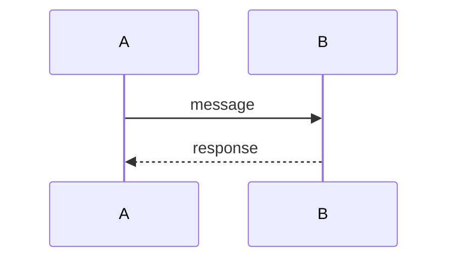
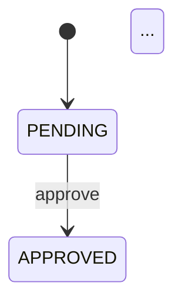

# TRD Writer

Analyze a codebase using Coordinator + Workers + Merger multi-agent architecture, then generate a structured TRD.

## Goal

Produce a TRD that accurately describes an existing codebase's architecture, data models, interfaces, workflows, and core algorithms. The document should enable readers to understand the codebase without reading source code.

## Hard Constraints

- All content must be derived from actual code. Never fabricate features.
- TRD must be written in the same language the user uses in conversation.
- Mark genuinely unclear system behavior/intent with `[INFERRED]` tags. Do NOT use `[INFERRED]` for bugs, code review, performance concerns, or standard patterns.
- No large code blocks — use type signatures, interface definitions, and short snippets only. Exception: core business formulas/algorithms should be documented in full.
- All sub-agents **must write output to files** in `{project_root}/trd_work/`. Never rely on Task return value for long content.
- **Max 10 parallel Worker agents per batch**. If more Workers needed, run in batches.
- **TRD format must strictly follow `reference.md` template**. Do NOT add metadata like generation time, file paths, or document info sections.
- **100% Code Coverage**: Every source file must be analyzed. No file may be skipped or summarized. Coordinator must assign files explicitly, Workers must report analysis status per file, Reviewer must verify coverage.

## TRD Format Requirements

### Title Format

**For complete project analysis**:
```
# {Project Name} — Technical Requirements Document (TRD)
```

**For sub-module analysis (when project is split into batches)**:
```
# {module_path} — Technical Requirements Document (TRD)
```

### Project Summary Requirements (Section 1.1)

**When analyzing a sub-module** (i.e., project split into multiple TRDs by directory), the Project Summary MUST:
1. Clearly state this is a sub-module of the parent project
2. Explain the module's role and responsibilities within the larger system
3. Describe relationships with other modules (dependencies, data flow, API calls)

**When analyzing a complete project**, describe the project normally.

### Forbidden Elements
- Document generation time/date
- File path metadata sections
- "Document Info" or similar meta-sections
- Any content not derived from actual code

## Cross-Path Analysis Requirements

Workers and Reviewers are **NOT limited to the assigned directory**. They MUST:

1. **Search across the entire project** for related files:
   - Database models may be in `app/common/model/`, shared libraries, or other locations
   - Configuration files may be in project root `config/`, `.env`, or module-specific config directories
   - Shared utilities may be in `lib/`, `utils/`, `common/`, etc.

2. **Trace dependencies fully**:
   - Follow imports/requires to understand data flow
   - Check database table definitions wherever they are defined
   - Verify external service integrations across module boundaries

3. **Resolve [INFERRED] items by cross-path investigation**:
   - Reviewers must search the entire project, not just the Worker's assigned path
   - Only mark as [UNRESOLVED] after exhaustive cross-path search

## Deep Analysis Requirements

Since TRD is generated per module (not entire project at once), each module deserves **thorough analysis**:

1. **100% Code Logic Coverage**:
   - Every function/method must be documented — no "key functions only"
   - Every API endpoint must be listed — no "selected endpoints"
   - Every state machine state and transition must be recorded
   - Every algorithm variant must be documented (e.g., long/short, different asset types)
   - Every data flow path must be traced
   - Do NOT summarize with "etc.", "...", "and more", or "similar to above"

2. **Per-File Analysis Mandate**:
   - Every source file assigned to a Worker MUST have an individual analysis entry
   - `controller/*.php` — each file analyzed individually with all methods
   - `command/*.php` — each file analyzed individually with full command logic
   - `model/*.php` — each file analyzed individually with all fields and relationships
   - Do NOT group files as "(Selected)" or "(Key files)" — analyze ALL

3. **File Analysis Tracking**:
   - Workers must output a **File Analysis Index** table listing every assigned file
   - Each file entry must show: path, analysis status (✓ Analyzed / ⚠ Partial / ✗ Skipped), and section references
   - Reviewer will audit this index for completeness

4. **For large directories (>50 files)**:
   - Split into multiple Workers (e.g., A-M and N-Z)
   - Each Worker handles fewer files with deeper analysis
   - File assignment must be explicit (full path list), not pattern-based

## TRD Structure Overview

The final TRD follows this structure (details in `reference.md`):

```
1. Project Overview
   1.1 Project Summary
   1.2 Tech Stack
   1.3 Project Structure
   1.4 Glossary

2. Architecture
   2.1 System Architecture
   2.2 Module Breakdown
   2.3 External Dependencies

3. Data Model
   3.1 Entity Definitions
   3.2 Entity Relationships
   3.3 Data Flow

4. Interface Design
   4.1 External Interfaces
   4.2 Internal Interfaces
   4.3 External Integrations

5. Core Logic
   5.1 Primary Flows
   5.2 Core Algorithms
   5.3 Background Processes
   5.4 State Transitions

6. Runtime Configuration
   6.1 Configuration Items
   6.2 Deployment

7. Observability
   7.1 Logging
   7.2 Monitoring & Alerting
   7.3 Error Handling

8. File Index
```

## Workflow

All intermediate and final files are stored in `{project_root}/trd_work/`.

### Phase 1: Coordinator (1 sub-agent)

Launch **one** `generalPurpose` Task agent.

**Input**: project root path.

**Agent instructions** — the Coordinator must:

1. Scan directory tree, dependency files (`go.mod`, `package.json`, etc.), README, entry points.
2. **Enumerate ALL source files** using `git ls-files` or directory scan. Exclude:
   - Test files: `*_test.go`, `*.test.ts`, `*.spec.ts`, `test_*.py`, `*Test.java`, `*_test.php`
   - Generated files: `*.pb.go`, `*.pb.ts`, `*_generated.*`, `*.gen.*`, `*.min.js`, `*.min.css`
   - Dependencies: `vendor/`, `node_modules/`, `.venv/`, `target/`, `dist/`, `build/`
   - Assets: `*.png`, `*.jpg`, `*.svg`, `*.ico`, `*.woff`, `*.ttf`
3. Identify tech stack, module boundaries, core entities, and glossary.
4. Divide files into Worker groups:
   - **Max 10 Workers per batch** (if more needed, plan for multiple batches)
   - **Each Worker gets an EXPLICIT FILE LIST** (not just directory paths)
   - For large directories (>100 files), split into multiple Workers
   - Root-level files (e.g., `controller/*.php`) should have dedicated Workers
   - Aim for <150 files per Worker for thorough analysis
5. **Write** the result to `{project_root}/trd_work/project_profile.md` using the Write tool.
6. **Generate Worker TODO files**: For each Worker, create `{project_root}/trd_work/worker_{N}_todo.md` with:
   ```
   # Worker {N} TODO: {group name}
   
   ## File Checklist
   - [ ] src/controller/UserController.php
   - [ ] src/controller/OrderController.php
   - [ ] src/service/PaymentService.php
   ... (one checkbox per assigned file)
   
   ## Progress
   - Total Files: {N}
   - Completed: 0
   - Remaining: {N}
   ```
7. Return a one-line confirmation with the file path and Worker count.

**Project Profile schema** (Coordinator must follow):

```
# Project Profile: {name}

## Project Summary
(2-3 sentences describing what this project does)

## Tech Stack
| Layer | Technology | Version |

## Project Structure
(directory tree with descriptions)

## File Inventory
| Category | Count | Example Paths |
|----------|-------|---------------|
| Total Source Files | {N} | |
| Excluded (test) | {N} | |
| Excluded (generated) | {N} | |
| Excluded (vendor) | {N} | |
| **Files to Analyze** | {N} | |

## Module Assignment

### Worker 1: {group name}
| # | File Path | Category |
|---|-----------|----------|
| 1 | src/controller/UserController.php | Controller |
| 2 | src/controller/OrderController.php | Controller |
| ... | ... | ... |
**Total Files: {N}**

### Worker 2: {group name}
| # | File Path | Category |
|---|-----------|----------|
| 1 | ... | ... |
**Total Files: {N}**

(up to Worker 10; if more needed, indicate batching plan with file counts per batch)

## Core Entities
(type names + source files)

## Glossary
| Term | Definition |

## Entry Point Analysis
(startup flow summary)
```

**Stop condition**: Coordinator finishes when `project_profile.md` is written.

### Phase 2: Workers (up to 10 parallel sub-agents)

After Coordinator completes, read `project_profile.md` to get module assignments.

Launch **up to 10** parallel `generalPurpose` Task agents. Each Worker gets:

1. The full content of `project_profile.md` (embed in prompt as shared context).
2. The **explicit file list** assigned to this Worker (from Module Assignment table).
3. An output file path: `{project_root}/trd_work/worker_{N}.md`.

**Agent instructions** — each Worker must:

1. **Read TODO file**: Read `{project_root}/trd_work/worker_{N}_todo.md` to get assigned file list.
2. **For EACH file in TODO** (in order):
   a. Read the source file completely
   b. Analyze: all functions/methods, data structures, flows, algorithms
   c. Write analysis to report
   d. **Update TODO**: Change `- [ ] path/to/file.php` to `- [x] path/to/file.php` and increment "Completed" count
3. **Cross-path search** for related files (models, configs, utilities) in other directories.
4. After ALL files analyzed, **Write** the full report to `{project_root}/trd_work/worker_{N}.md` using the Write tool.
5. **Final TODO update**: Verify all checkboxes are checked, set "Remaining: 0".
6. Return: "Worker {N} complete — {X}/{Y} files analyzed (100%)"

**Worker Output Schema** (each Worker report must follow this structure):

```
# Worker {N} Report: {group name}

## File Analysis Index

| # | File Path | Status | Sections |
|---|-----------|--------|----------|
| 1 | src/controller/UserController.php | ✓ Analyzed | Interface, Core Flow |
| 2 | src/controller/OrderController.php | ✓ Analyzed | Interface, Core Flow, Algorithms |
| 3 | src/service/PaymentService.php | ✓ Analyzed | Interface, Core Flow, Error Handling |
| ... | ... | ... | ... |

**Coverage Summary**:
- Assigned Files: {N}
- Analyzed: {N} (✓)
- Partial: {N} (⚠) — list reasons
- Skipped: {N} (✗) — list reasons (MUST justify each skip)

---

# Module: {name}

## Responsibility
One sentence describing this module's purpose.

## All Source Files
| # | File Path | Role | Lines | Functions/Methods |
|---|-----------|------|-------|-------------------|
| 1 | path/to/file.php | Description | 245 | methodA, methodB, methodC |
| 2 | ... | ... | ... | ... |

(List EVERY file with ALL its functions/methods)

## Data Model
Struct/table/proto definitions with ALL fields, types, and descriptions.
Include: field name, type, constraints, default value, description.

## Interface — All Public Methods
For EACH public function/method in this module:

### {ClassName}::{methodName}()
- **File**: path/to/file.php:L123
- **Signature**: `function methodName(Type $param): ReturnType`
- **Purpose**: What this method does
- **Parameters**: 
  - `$param` (Type): description
- **Returns**: description
- **Throws**: ExceptionType — when
- **Called by**: list callers
- **Calls**: list callees

(Repeat for EVERY public method — no "and similar methods" or "etc.")

## API Endpoints (if applicable)
For EACH endpoint:
| Method | Path | Handler | Request | Response | Auth |
| POST | /api/users | UserController@create | CreateUserRequest | UserResponse | JWT |
| ... | ... | ... | ... | ... | ... |

(List ALL endpoints — no "key endpoints only")

## Core Flow — All Business Processes
For EACH business process/workflow:

### Flow: {ProcessName}
1. Step 1: description
2. Step 2: description
   - Sub-step 2a: detail
   - Sub-step 2b: detail
3. Step 3: description
...



(Document EVERY flow with sequence diagram — no "similar to above")

## Core Algorithms — All Business Logic
For EACH calculation, formula, or decision logic:

### Algorithm: {name}
- **Location**: file.php:L123, function `calculateX()`
- **Purpose**: What it calculates/decides
- **Formula**: 
  $$result = \frac{a \times b}{c + d}$$
- **Variables**:
  - `a`: description (source: where it comes from)
  - `b`: description
  - `c`: description
  - `d`: description
- **Variants**:
  - Case A (when condition1): formula_A
  - Case B (when condition2): formula_B
- **Edge Cases**: list all edge case handling

(Document EVERY algorithm — if module has none, write "No business algorithms in this module")

## State Machines (if applicable)
For EACH state machine:

### State Machine: {EntityName}
- **States**: list ALL states
- **Transitions**:
  | From | Event | To | Guard | Action |
  |------|-------|----|-------|--------|
  | PENDING | approve | APPROVED | hasPermission | notifyUser |
  | ... | ... | ... | ... | ... |



## Error Handling
For EACH error type:
| Error Type | Trigger Condition | Handling Strategy | Retry | Fallback |
|------------|-------------------|-------------------|-------|----------|
| ValidationError | Invalid input | Return 400 | No | — |
| ... | ... | ... | ... | ... |

## Dependencies
- **Internal**: [which other modules, with specific imports]
- **External**: [which libraries/services, with version if known]

## Uncertain
Items marked [INFERRED] — ONLY for cases where system behavior or intent
genuinely cannot be determined from the code. See rules below.
```

**[INFERRED] usage rules** (Workers must follow strictly):

`[INFERRED]` means: "I read the code but cannot determine what the system does or why."

Use ONLY for:
- External system integration whose direction/purpose is unclear from code alone
- Commented-out code blocks whose original purpose cannot be determined
- Cross-system data sources where the origin is ambiguous
- Module responsibility that is genuinely unclear from naming and code

Do NOT mark as [INFERRED]:
- Bugs, logic errors, or incorrect implementations — these are code review, not TRD
- Performance concerns or optimization suggestions
- Code style, naming issues, or typos
- Standard framework/library usage patterns (e.g., `go build -ldflags`, gRPC-Gateway annotations)
- TODO/unimplemented features — document these factually in the relevant section (e.g., "currently unimplemented") without [INFERRED]
- Design improvement suggestions
- Security observations (e.g., hardcoded keys)

**Stop condition**: Worker finishes when its `worker_{N}.md` is written.

**Batching**: If modules require > 10 Workers, run in batches. Wait for batch 1 to complete before launching batch 2.

### Phase 3: Review (up to 10 parallel sub-agents)

After all Workers complete, the main agent performs these steps:

**Step 1 — Extract**: Use Grep to find all `[INFERRED]` items across `worker_*.md` files.

**Step 2 — Dispatch**: Launch **up to 10** parallel `generalPurpose` Reviewer Task agents, **one per Worker report**. Each Reviewer gets:

1. The **TODO file**: `{project_root}/trd_work/worker_{N}_todo.md`
2. The Worker report: `{project_root}/trd_work/worker_{N}.md`
3. The project root path for source code access.
4. An output file path: `{project_root}/trd_work/review_patches_worker_{N}.md`.

**Agent instructions** — each Reviewer must perform TWO audits:

#### Audit A: Coverage Verification (via TODO file)

1. Read `worker_{N}_todo.md` and check:
   - ALL checkboxes are checked `[x]`
   - "Remaining: 0" in Progress section
   - No unchecked `[ ]` items
2. For each checked file, verify in `worker_{N}.md`:
   - File appears in File Analysis Index
   - File's methods are documented in Interface section
3. Report any gaps:
   - Unchecked files in TODO (CRITICAL — not analyzed)
   - Checked but not in report (TODO updated but analysis missing)
   - Partial analysis (file in report but methods missing)

#### Audit B: [INFERRED] Resolution

1. Extract every `[INFERRED]` item from the report.
2. For **each** item:
   - **Cross-path search**: Look in the ENTIRE project, not just the Worker's assigned path
   - Read whatever source files are needed to verify — no file read limit
   - Check database definitions, config files, related modules
   - Either:
     - **Confirm**: inference is correct → replace with confirmed description + evidence.
     - **Correct**: inference is wrong → provide the correct description + evidence.
     - **Unresolvable**: genuinely cannot determine after exhaustive search → mark `[UNRESOLVED]` with explanation of what was searched.

**Write** results to `{project_root}/trd_work/review_patches_worker_{N}.md` using the Write tool, following this format:

```
# Review Patches — Worker {N}

## Coverage Audit

### File Coverage
| # | File Path | Assigned | Indexed | Analyzed | Issues |
|---|-----------|----------|---------|----------|--------|
| 1 | path/to/file.php | ✓ | ✓ | ✓ | — |
| 2 | path/to/other.php | ✓ | ✓ | ⚠ | Missing methods: foo(), bar() |
| 3 | path/to/missing.php | ✓ | ✗ | ✗ | FILE NOT ANALYZED |

### Coverage Summary
- Assigned Files: {N}
- Fully Analyzed: {N}
- Partial: {N} — requires re-analysis
- Missing: {N} — CRITICAL: requires re-analysis

### Missing Content Details
(For each partial/missing file, list what's missing)

---

## [INFERRED] Resolution

### Patch 1
- Source: worker_{N}.md, Module: {name}, Section: {section}
- Original [INFERRED]: {original text}
- Status: Confirmed / Corrected / Unresolved
- Resolution: {verified description with evidence}
- Evidence: {file path and relevant code reference}

### Patch 2
...

### Summary
- Total [INFERRED] items: {count}
- Confirmed: {count}
- Corrected: {count}
- Unresolved: {count}
```

Return: "Review complete — Coverage: X/Y files (Z%), [INFERRED]: A confirmed, B corrected, C unresolved"

**Stop condition**: Each Reviewer finishes when its `review_patches_worker_{N}.md` is written. Max 2 rounds total (prevent infinite loops).

**Re-analysis trigger**: If Coverage Audit finds missing files (>0), the main agent must either:
1. Launch additional Workers to analyze missing files, OR
2. Resume the original Worker with explicit instructions to analyze the missing files

### Phase 4: Merger (Layered Approach)

After Review completes (or is skipped), calculate total lines in all `worker_*.md` files.

**Decision Logic**:
- If total lines **< 5000**: Launch **one** Merger agent (simple merge)
- If total lines **>= 5000**: Launch **Section Mergers** in parallel, then **Final Merger** (layered merge)

#### Simple Merge (< 5000 lines)

Launch **one** `generalPurpose` Task agent to merge all content into `TRD.md`.

#### Layered Merge (>= 5000 lines)

**Phase 4a: Section Mergers (up to 5 parallel)**

Based on project_profile.md Worker assignments, group Workers by TRD section:

| Section Merger | TRD Sections | Typical Worker Sources |
|----------------|--------------|------------------------|
| Merger A | 1-2 (Overview + Architecture) | project_profile.md + all workers (summary) |
| Merger B | 3 (Data Model) | Workers handling model/* files |
| Merger C | 4 (Interface Design) | Workers handling controller/* files |
| Merger D | 5 (Core Logic) | Workers handling logic/*, command/* files |
| Merger E | 6-8 (Config + Observability + Index) | Workers handling config/*, validate/*, library/* |

Each Section Merger:
1. Reads only the relevant `worker_*.md` files for its section
2. Reads `review_patches_worker_*.md` if they exist
3. Writes to `{project_root}/trd_work/section_{A|B|C|D|E}.md`
4. **Preserves ALL detail** — no summarization

**Phase 4b: Final Assembly (shell command)**

After all Section Mergers complete, assemble via shell command:

```bash
# Create TRD header
echo "# {module_path} — Technical Requirements Document (TRD)" > TRD.md
echo "" >> TRD.md

# Concatenate sections (skip section file headers)
tail -n +2 section_A.md >> TRD.md
tail -n +1 section_B.md >> TRD.md
tail -n +1 section_C.md >> TRD.md
tail -n +1 section_D.md >> TRD.md
tail -n +1 section_E.md >> TRD.md
```

No additional agent needed — Section Mergers already produced properly formatted content.

**Merger Rules (apply to all mergers)**:
- **Title format**: `# {module_name} — Technical Requirements Document (TRD)`
- **No metadata**: Do NOT add generation time, file paths, or document info sections
- **100% Content Preservation** (CRITICAL):
  - Do NOT summarize, truncate, or use "etc.", "...", "and more", "similar to above"
  - EVERY function/method documented by Workers MUST appear in final TRD
  - EVERY algorithm/formula MUST be preserved with full detail
  - EVERY state machine MUST be preserved
  - EVERY endpoint MUST be listed
  - If Workers documented it, Merger MUST include it
- Unify terminology using the glossary
- Apply review patches
- Reference real file paths
- No `[INFERRED]` should remain
- Deduplicate only EXACT duplicates (same content in multiple Worker reports)

**Stop condition**: Phase 4 finishes when `TRD.md` is written.

### Phase 5: Final Coverage Verification

After Merger completes, verify 100% coverage before delivery:

**Step 1 — Build Coverage Matrix**:

1. Read `project_profile.md` to get the complete list of assigned files (all Workers combined).
2. Read `TRD.md` and extract all documented files from File Index (Section 8).
3. Compare and generate coverage report:

```
## Coverage Verification Report

### File Coverage
| Metric | Count | Percentage |
|--------|-------|------------|
| Total Assigned | {N} | 100% |
| Documented in TRD | {N} |  |

### Missing Files (if any)
| # | File Path | Assigned Worker | Issue |
|---|-----------|-----------------|-------|
| 1 | path/to/missing.php | Worker 3 | Not in File Index |
| ... | ... | ... | ... |

### Content Completeness Spot Check
(Random sample of 5 files — verify all methods documented)
| File | Total Methods | Documented | Coverage |
|------|---------------|------------|----------|
| file1.php | 12 | 12 | 100% |
| ... | ... | ... | ... |
```

**Step 2 — Remediation** (if coverage < 100%):

If missing files are found:
1. Launch additional Worker(s) to analyze missing files
2. Re-run Merger to incorporate new content
3. Repeat verification

**Step 3 — Write coverage report**: Save to `{project_root}/trd_work/coverage_report.md`

### Phase 6: Deliver

After Coverage Verification passes (100% coverage achieved):

**Step 1 — Generate manifest** (for future incremental updates by `trd-updater`):

1. Read `project_profile.md` Module Assignment section.
2. Build a JSON object mapping module names to their directory paths, e.g.:
   ```json
   {"chain_apis":"chain/apis/","center":"center/","public_models":"public/models/"}
   ```
   Use normalized names (underscores, no parenthetical notes). Merge sub-modules that belong to the same directory.
3. Run: `python3 ~/.agents/skills/trd-writer-new/scripts/manifest.py {project_root} '<module_map_json>'`

The script gets git HEAD commit, runs `git ls-files` for each module path, and writes `{project_root}/trd_work/manifest.json`. Returns JSON to stdout.

**Step 2 — Present summary** to the user (no questions, just deliver):

- **Coverage**: X/Y files (100%)
- Total modules documented
- Key architecture highlights
- Number of `[UNRESOLVED]` items (if any)
- File path to the full TRD
- Manifest written (commit hash recorded for future incremental updates)

## Module Splitting Rules

The Coordinator uses these rules to assign modules to Workers:

1. Each top-level directory is one module.
2. Directory with > 100 files → split into multiple Workers (e.g., by alphabetical range or subdirectory).
3. Directory with > 50 files → consider splitting if Workers have capacity.
4. Directory with < 5 files → merge with a related directory.
5. **Root-level files** (e.g., `controller/*.php`) → dedicate Workers to ensure thorough analysis.
6. Special directories (`proto/`, `migrations/`, `config/`, `test/`) → group by relevance.
7. Static assets, generated code, and `vendor/` → exclude from analysis.
8. Group modules by coupling (modules that import each other belong to the same Worker).
9. Balance file count across Workers (aim for roughly equal load, ideally <150 files per Worker).

## Verification Checklist

Before delivering, verify:

### Coverage (MUST be 100%)
- [ ] **File Coverage**: Every assigned file is listed in File Index (Section 8)
- [ ] **Method Coverage**: Every public method in each file is documented in Interface section
- [ ] **Endpoint Coverage**: Every API endpoint is listed (not "key endpoints")
- [ ] **Algorithm Coverage**: Every business calculation/formula is documented
- [ ] **State Machine Coverage**: Every state and transition is documented
- [ ] **Flow Coverage**: Every business process has step-by-step description + sequence diagram

### Completeness (No Summaries)
- [ ] No "etc.", "...", "and more", "similar to above", or "(Selected)" in document
- [ ] No "Key files" — must be "All files"
- [ ] No "Key endpoints" — must be "All endpoints"
- [ ] No "Key methods" — must be "All methods"
- [ ] All root-level files documented individually (not grouped)

### Accuracy
- [ ] Architecture diagram matches actual code structure
- [ ] File path references point to real files
- [ ] Data model matches actual schema/struct definitions
- [ ] API definitions match actual route/handler registrations
- [ ] Core algorithms/formulas have correct mathematical notation
- [ ] No fabricated features

### Quality
- [ ] No `[INFERRED]` tags remain — all resolved or marked `[UNRESOLVED]` inline
- [ ] Mermaid diagrams are syntactically correct
- [ ] Document language matches user's language
- [ ] Cross-module flows have sequence diagrams
- [ ] **TRD title follows format**: `# {name} — Technical Requirements Document (TRD)`
- [ ] **No metadata sections** (generation time, file paths, etc.)

### Coverage Report
- [ ] `coverage_report.md` shows 100% file coverage
- [ ] Spot check passed (random sample of files verified)

## Examples

Examples document special project structures. **During Phase 1 (Coordinator)**, check if the project matches any example pattern. If it does, **read the example file and follow its strategy** for module scoping, Worker assignment, and analysis approach.

| Example | Detection Signal | Description |
|---------|------------------|-------------|
| [`examples/kratos-subapis.md`](examples/kratos-subapis.md) | `apis/` submodule + `internal/service/` + Kratos imports | Identify project-specific protos from service layer imports, skip unrelated public protos |

## When NOT to Use This Skill

- Designing a new system — use a forward-design approach instead.
- User wants a PRD, not a technical doc.
- User wants a code review, not documentation.
