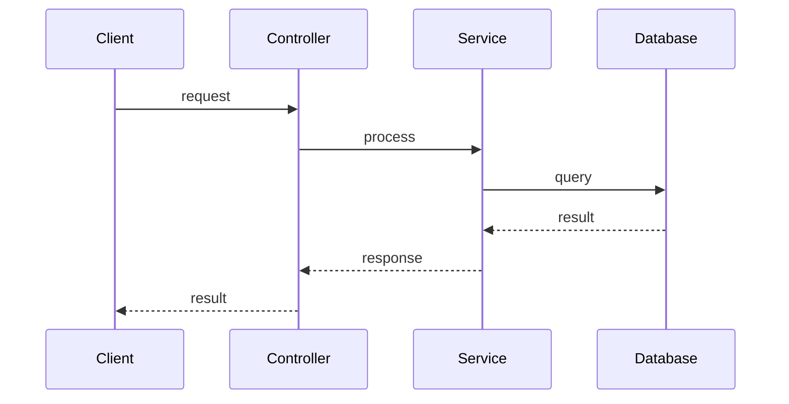
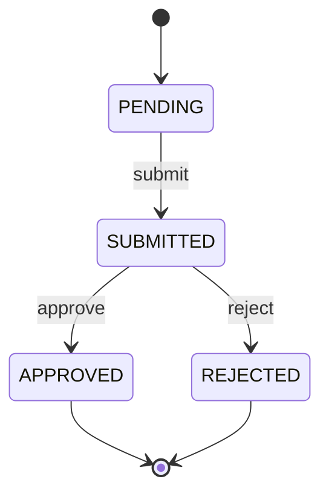

# TRD Writer — Reference

Detailed templates and prompt examples for each sub-agent phase. Read this file when constructing sub-agent prompts.

## TRD Output Template

The Merger agent must produce a TRD following this structure. Include/exclude sections per the rules table below.

```markdown
# {Project Name} — Technical Requirements Document (TRD)

## 1. Project Overview

### 1.1 Project Summary
A concise description (2-3 paragraphs) of what this project does, its primary responsibilities, and how it fits into the larger system. Derived from README, comments, entry points, and code behavior.

**For sub-module analysis**: Must clearly state this is a sub-module, explain its role in the parent project, and describe relationships with other modules.

### 1.2 Tech Stack
| Layer | Technology | Version |
|-------|-----------|---------|

### 1.3 Project Structure
Directory tree with module descriptions.

### 1.4 Glossary
| Term | Definition |
|------|-----------|
Domain-specific terminology required to understand the system.

## 2. Architecture

### 2.1 System Architecture
Mermaid architecture diagram showing major components and connections.

### 2.2 Module Breakdown
For each module: responsibility, key files, dependencies.

### 2.3 External Dependencies
Third-party services, libraries, upstream/downstream systems.

## 3. Data Model

### 3.1 Entity Definitions
All persistent tables/collections/structs with field-level detail. Include source file references.

### 3.2 Entity Relationships
Mermaid ER diagram.

### 3.3 Data Flow
How data enters, transforms, and exits the system.

## 4. Interface Design

### 4.1 External Interfaces
For each endpoint/RPC/message channel: method, path/topic, description, request/response types.

### 4.2 Internal Interfaces
Key exported functions, service interfaces, module boundary contracts.

### 4.3 External Integrations
Protocol, authentication, data format for each integration.

## 5. Core Logic

### 5.1 Primary Flows
End-to-end request flows with Mermaid sequence diagrams.

### 5.2 Core Algorithms
Document key business formulas, calculation logic, and decision algorithms. For each:
- **Name & Location**: Function/method name and file path
- **Purpose**: What it calculates or decides
- **Formula/Logic**: Mathematical formula (use LaTeX: `$formula$`) or pseudocode
- **Variables**: Explanation of each input parameter
- **Variants**: Different cases (e.g., by direction, mode, asset type) — document ALL variants with their respective formulas

This section is critical for finance, trading, risk management, ML/AI, pricing, scheduling, and similar domains.

### 5.3 Background Processes
Workers, cron jobs, event consumers, scheduled tasks.

### 5.4 State Transitions
Lifecycle state machines found in code.

## 6. Runtime Configuration

### 6.1 Configuration Items
All configuration keys with descriptions, types, default values, and valid ranges.

### 6.2 Deployment
Containerization, process model, resource requirements, startup sequence.

## 7. Observability

### 7.1 Logging
Log levels, formats, key log points, log rotation.

### 7.2 Monitoring & Alerting
Metrics exposed, alert conditions, notification channels.

### 7.3 Error Handling
Error types, retry patterns, fallback strategies, degradation behavior.

## 8. File Index
| Category | File Path | Description |
|----------|-----------|-------------|
Reference table mapping key files to their roles.
```

### Title Format Rules

| Scenario | Title Format |
|----------|--------------|
| Complete project analysis | `# {Project Name} — Technical Requirements Document (TRD)` |
| Sub-module analysis (project split by directory) | `# {module_path} — Technical Requirements Document (TRD)` |

### Section Inclusion Rules

| Section | Include When | If Not Applicable |
|---------|-------------|-------------------|
| Project Overview | Always | — |
| Architecture | Always | — |
| Data Model | Always | Write "No persistent entities in this module" |
| Interface Design | Always | Write "No public interfaces in this module" |
| Core Logic | Always | Write "No multi-step flows in this module" |
| Core Algorithms | Always | Write "No business algorithms in this module" |
| Runtime Configuration | Always | Write "No configuration items in this module" |
| Observability | Always | Write "No logging/metrics in this module" |
| File Index | Always | — |

**Rationale**: All sections are included to ensure 100% coverage. Empty sections explicitly state "None" rather than being omitted, so reviewers can verify nothing was accidentally skipped.

### Forbidden Elements

Do NOT include in TRD:
- Document generation time/date
- File path metadata sections
- "Document Info" or similar meta-sections
- Any content not derived from actual code

## Coordinator Prompt Template

Use this as a base when constructing the Coordinator sub-agent prompt. Replace `{project_root}` with the actual path.

```
You are a TRD Coordinator Agent. Your task is to scan a project, enumerate ALL source files, and produce a Project Profile with EXPLICIT file assignments.

## Target Project
Path: {project_root}

## Steps

1. **Enumerate ALL source files** using: `git ls-files` or directory scan.
2. **Categorize each file**:
   - Source files (to analyze): *.go, *.php, *.py, *.ts, *.js, *.java, *.kt, *.rs, *.rb, etc.
   - Test files (exclude): *_test.go, *.test.ts, *.spec.ts, test_*.py, *Test.java, *_test.php
   - Generated files (exclude): *.pb.go, *.pb.ts, *_generated.*, *.gen.*, *.min.js, *.min.css
   - Vendor/deps (exclude): vendor/, node_modules/, .venv/, target/, dist/, build/
   - Assets (exclude): *.png, *.jpg, *.svg, *.ico, *.woff, *.ttf, *.mp3, *.mp4
3. **Check for special project patterns**: Refer to the Examples table in SKILL.md.
4. Read dependency files (go.mod, package.json, requirements.txt, etc.).
5. Read README and entry point files.
6. Map directory structure and identify module boundaries.
7. **Assign EXPLICIT file lists to Workers**:
   - Max 10 Workers per batch
   - Each Worker gets a NUMBERED LIST of specific file paths (not just directory names)
   - Large directories (>100 files) split across multiple Workers
   - Aim for <150 files per Worker
   - Every source file MUST be assigned to exactly one Worker
8. Write the Project Profile to {project_root}/trd_work/project_profile.md using the Write tool.
9. **Generate Worker TODO files**: For EACH Worker, create {project_root}/trd_work/worker_{N}_todo.md:

```markdown
# Worker {N} TODO: {group name}

## Instructions
- Analyze each file in order
- After analyzing a file, change `[ ]` to `[x]`
- Update the Completed/Remaining counts
- Do NOT skip any file

## File Checklist
- [ ] src/controller/UserController.php
- [ ] src/controller/OrderController.php
- [ ] src/service/PaymentService.php
- [ ] src/model/User.php
... (one checkbox per assigned file, in analysis order)

## Progress
- Total Files: {N}
- Completed: 0
- Remaining: {N}
- Last Updated: {timestamp}
```

10. Return: "Project Profile + {Y} Worker TODO files written"

## Project Profile Format

# Project Profile: {name}

## Project Summary
(2-3 sentences describing what this project does)

## Tech Stack
| Layer | Technology | Version |

## Project Structure
(directory tree with descriptions)

## File Inventory
| Category | Count | Example Paths |
|----------|-------|---------------|
| Total Source Files | {N} | |
| Excluded (test) | {N} | *_test.go, *.spec.ts |
| Excluded (generated) | {N} | *.pb.go, *.gen.* |
| Excluded (vendor) | {N} | vendor/*, node_modules/* |
| Excluded (assets) | {N} | *.png, *.svg |
| **Files to Analyze** | {N} | |

## Module Assignment

### Worker 1: {group name}
| # | File Path | Category |
|---|-----------|----------|
| 1 | src/controller/UserController.php | Controller |
| 2 | src/controller/OrderController.php | Controller |
| 3 | src/controller/PaymentController.php | Controller |
| ... | ... | ... |
**Total Files: {N}**

### Worker 2: {group name}
| # | File Path | Category |
|---|-----------|----------|
| 1 | src/service/UserService.php | Service |
| 2 | src/service/OrderService.php | Service |
| ... | ... | ... |
**Total Files: {N}**

(continue for all Workers; if more than 10 Workers needed, indicate batching plan)

### Batch Summary
| Batch | Workers | Files | Status |
|-------|---------|-------|--------|
| Batch 1 | Worker 1-10 | {N} | To run first |
| Batch 2 | Worker 11-15 | {N} | After Batch 1 |

## Core Entities
(type names + source files)

## Glossary
| Term | Definition |

## Entry Point Analysis
(startup flow summary)

## Rules
- **Every source file MUST be assigned** — no file left unassigned
- Shallow scan only — do not analyze business logic in depth
- Prioritize: dependency files → entry points → directory structure
- Exclude: vendor/, node_modules/, generated code, test files, static assets
- Group tightly coupled modules (heavy cross-imports) into the same Worker
- Split large directories to ensure thorough analysis
```

## Worker Prompt Template

Use this as a base for each Worker sub-agent. Replace placeholders.

```
You are a TRD Worker Agent. Analyze EVERY assigned file and write a comprehensive report with 100% coverage.

## Project
Path: {project_root}

## Shared Context (Project Profile)
{paste full content of project_profile.md here}

## Your Assignment
You are Worker {N}. Your TODO file is at: {project_root}/trd_work/worker_{N}_todo.md

## Steps

1. **Read TODO file**: Read `worker_{N}_todo.md` to get your file checklist.
2. **Process each file IN ORDER**:
   ```
   FOR each unchecked file in TODO:
       a. Read the source file completely
       b. Analyze: all functions/methods, data structures, flows, algorithms
       c. Write analysis to your report (append to worker_{N}.md)
       d. UPDATE TODO: Change `- [ ] path/file.php` to `- [x] path/file.php`
       e. UPDATE Progress: Increment Completed, Decrement Remaining
   END FOR
   ```
3. **Cross-path search**: Look for related files in other directories (models, configs, utilities).
4. After ALL files analyzed, finalize report structure in `worker_{N}.md`.
5. **Verify TODO**: Ensure all checkboxes are `[x]` and "Remaining: 0".
6. Return: "Worker {N} complete — {X}/{Y} files (100%), TODO fully checked"

## Output Format

# Worker {N} Report: {group name}

## File Analysis Index

| # | File Path | Status | Methods | Sections |
|---|-----------|--------|---------|----------|
| 1 | src/controller/UserController.php | ✓ Analyzed | create, update, delete, list | Interface, Core Flow |
| 2 | src/controller/OrderController.php | ✓ Analyzed | checkout, cancel, refund | Interface, Core Flow, Algorithms |
| ... | ... | ... | ... | ... |

**Coverage Summary**:
- Assigned Files: {N}
- Analyzed: {N} ✓
- Partial: 0 ⚠ (if any, list file + missing parts)
- Skipped: 0 ✗ (if any, list file + reason — MUST justify)

---

# Module: {name}

## Responsibility
One sentence describing this module's purpose.

## All Source Files
| # | File Path | Lines | All Functions/Methods |
|---|-----------|-------|----------------------|
| 1 | path/to/file.php | 245 | __construct(), create(), update(), delete(), validate(), ... |
| 2 | path/to/other.php | 180 | process(), handle(), transform(), ... |
(List EVERY file with ALL its functions — no "etc." or "and others")

## Data Model
For EACH struct/class/table:

### {ClassName}
| Field | Type | Constraints | Default | Description |
|-------|------|-------------|---------|-------------|
| id | int | PRIMARY KEY, AUTO_INCREMENT | — | Unique identifier |
| name | string | NOT NULL, MAX 255 | — | User's display name |
| ... | ... | ... | ... | ... |

(List ALL fields — no "and other standard fields")

## Interface — All Public Methods

### {ClassName}::{methodName}()
- **File**: path/to/file.php:L123
- **Signature**: `public function methodName(Type $param1, Type $param2): ReturnType`
- **Purpose**: What this method does
- **Parameters**:
  - `$param1` (Type): description
  - `$param2` (Type): description
- **Returns**: ReturnType — description
- **Throws**: 
  - `ExceptionType1` — when condition1
  - `ExceptionType2` — when condition2
- **Logic**:
  1. Step 1
  2. Step 2
  3. Step 3

(Repeat for EVERY public method in EVERY file — no "similar methods omitted")

## API Endpoints
| # | Method | Path | Handler | Auth | Request | Response |
|---|--------|------|---------|------|---------|----------|
| 1 | POST | /api/users | UserController@create | JWT | CreateUserRequest | UserResponse |
| 2 | GET | /api/users/{id} | UserController@show | JWT | — | UserResponse |
| 3 | PUT | /api/users/{id} | UserController@update | JWT | UpdateUserRequest | UserResponse |
| ... | ... | ... | ... | ... | ... | ... |

(List ALL endpoints — no "and N similar endpoints")

## Core Flow — All Business Processes

### Flow: {ProcessName}
**Trigger**: What initiates this flow
**Actors**: Who/what participates
**Steps**:
1. Step 1: description
   - Detail 1a
   - Detail 1b
2. Step 2: description
3. Step 3: description
...



(Document EVERY distinct flow with sequence diagram — no "similar to above")

## Core Algorithms — All Business Logic

### Algorithm: {name}
- **Location**: file.php:L123-L145, function `calculateX()`
- **Purpose**: What it calculates/decides
- **Inputs**:
  - `$a` (float): description, source: where it comes from
  - `$b` (float): description
- **Formula**: 
  $$result = \frac{a \times b}{c + d}$$
- **Implementation**:
  ```
  if (condition1) {
      result = formula_A
  } else if (condition2) {
      result = formula_B
  }
  ```
- **Variants**:
  | Case | Condition | Formula |
  |------|-----------|---------|
  | Long position | direction == 'long' | $(entry - exit) \times qty$ |
  | Short position | direction == 'short' | $(exit - entry) \times qty$ |
- **Edge Cases**:
  - When X is zero: handled by...
  - When Y is negative: handled by...

(Document EVERY algorithm — if module has no algorithms, write "No business algorithms in this module")

## State Machines

### State Machine: {EntityName}
**States**: [STATE_A, STATE_B, STATE_C, STATE_D]

**Transitions**:
| # | From | Event | To | Guard | Action |
|---|------|-------|----|-------|--------|
| 1 | PENDING | submit | SUBMITTED | hasRequiredFields | sendNotification |
| 2 | SUBMITTED | approve | APPROVED | hasPermission | updateTimestamp |
| 3 | SUBMITTED | reject | REJECTED | — | notifyUser |
| ... | ... | ... | ... | ... | ... |



(Document EVERY state machine with ALL states and transitions)

## Error Handling
| # | Error Type | Trigger Condition | Handler | Retry | Fallback |
|---|------------|-------------------|---------|-------|----------|
| 1 | ValidationError | Invalid input | Return 400 | No | — |
| 2 | NotFoundError | Resource not found | Return 404 | No | — |
| 3 | DatabaseError | Connection failed | Log + Throw | 3 times | Return 503 |
| ... | ... | ... | ... | ... | ... |

## Dependencies
**Internal**:
- ModuleA: imports X, Y, Z
- ModuleB: imports A, B

**External**:
- library/package@version: used for X
- external-service: used for Y

## Uncertain
[INFERRED] items — ONLY for genuinely unclear system behavior.

## Rules (MUST follow)
- **100% file coverage**: Read and analyze EVERY assigned file
- **100% method coverage**: Document EVERY function/method in each file
- **No summarization**: Do NOT use "etc.", "...", "similar to above", "(Selected)"
- **Cross-path search**: Find related files in other directories
- **Use actual signatures**: Copy real function signatures from code
- **[INFERRED] rules**: ONLY for genuinely unclear behavior, NOT for bugs/style/TODOs
- **Your job**: DESCRIBE what the system does, NOT review code quality
```

## Reviewer Prompt Template

Each Reviewer handles a **single** Worker report. Launch up to 10 in parallel. Replace `{N}` with the Worker number.

```
You are a TRD Reviewer Agent. Your task is to:
1. **Verify 100% file coverage** — ensure every assigned file was analyzed
2. **Resolve [INFERRED] items** — verify or correct uncertain items

## Input
- TODO file: {project_root}/trd_work/worker_{N}_todo.md
- Worker report: {project_root}/trd_work/worker_{N}.md
- Source code root: {project_root}

## Steps

### Part 1: TODO Verification

1. Read `worker_{N}_todo.md` and verify:
   - ALL checkboxes are checked: `[x]` (no `[ ]` remaining)
   - Progress shows: "Remaining: 0"
   - Completed count matches Total count

2. If ANY unchecked `[ ]` items found:
   - List them as CRITICAL issues
   - Mark review as FAILED
   - These files were NOT analyzed

### Part 2: Report Verification

For EACH checked file in TODO:
1. Verify file appears in `worker_{N}.md` File Analysis Index
2. Verify file's methods are documented in Interface section
3. Check for completeness:
   - Read actual source file
   - Count public methods
   - Verify all are documented

Report any gaps:
- TODO checked but not in report (Worker error — marked done but didn't analyze)
- In report but methods missing (Partial analysis)

### Part 2: [INFERRED] Resolution

1. Extract every [INFERRED] item from worker_{N}.md.
2. For EACH [INFERRED] item:
   - **Cross-path search**: Look in the ENTIRE project, not just Worker's assigned path.
   - Check database definitions, config files, related modules, shared libraries.
   - Read whatever source files are needed to gather evidence.
   - Determine: Confirmed / Corrected / Unresolved.

### Part 3: Write Results

Write to {project_root}/trd_work/review_patches_worker_{N}.md:

# Review Patches — Worker {N}

## TODO Audit

### Checklist Status
| Metric | Count |
|--------|-------|
| Total Items | {N} |
| Checked [x] | {N} |
| Unchecked [ ] | {N} |

### Unchecked Items (CRITICAL)
| # | File Path | Issue |
|---|-----------|-------|
| 1 | src/controller/PaymentController.php | NOT ANALYZED — checkbox unchecked |
| ... | ... | ... |

(If all checked, write "All items checked ✓")

---

## Report Verification

### File Coverage Matrix
| # | File Path | TODO | In Index | In Report | Methods | Issues |
|---|-----------|------|----------|-----------|---------|--------|
| 1 | src/controller/UserController.php | [x] | ✓ | ✓ | 5/5 | — |
| 2 | src/controller/OrderController.php | [x] | ✓ | ✓ | 3/5 | Missing: refund(), cancel() |
| 3 | src/controller/PaymentController.php | [ ] | ✗ | ✗ | 0/? | TODO UNCHECKED |
| ... | ... | ... | ... | ... | ... | ... |

### Coverage Summary
| Metric | Count | Percentage |
|--------|-------|------------|
| Total Files | {N} | 100% |
| TODO Checked | {N} |  |
| Fully Analyzed | {N} |  |
| Missing | {N} | {%} |

### Issues Requiring Re-analysis
| # | File | Issue | Required Action |
|---|------|-------|-----------------|
| 1 | src/controller/PaymentController.php | TODO unchecked | Full analysis needed |
| 2 | src/controller/OrderController.php | Missing methods | Analyze refund(), cancel() |

---

## [INFERRED] Resolution

### Patch 1
- Source: worker_{N}.md, Module: {name}, Section: {section}
- Original [INFERRED]: {original text}
- Status: Confirmed / Corrected / Unresolved
- Resolution: {verified description with evidence}
- Evidence: {file path and relevant code reference}

### Patch 2
...

### Summary
- Total [INFERRED] items: {count}
- Confirmed: {count}
- Corrected: {count}
- Unresolved: {count}

---

## Final Verdict
- TODO Status: {X}/{Y} checked ()
- Re-analysis Required: Yes/No
- [INFERRED] Resolved: {X}/{Y}

**PASS Criteria**: 
- ALL TODO items checked [x]
- ALL checked files in report
- ALL methods documented

Return: "Review complete — TODO: X/Y checked, Coverage: X/Y files, Re-analysis: Yes/No"

## Rules
- **Coverage verification is mandatory** — check every assigned file
- **Cross-path search is mandatory** — search entire project for [INFERRED] items
- Read whatever source files are needed — no file limit
- Only mark as [UNRESOLVED] after exhaustive search — explain what was searched
- Do NOT modify worker_{N}.md directly — only write review_patches_worker_{N}.md
- If coverage < 100%, flag for re-analysis
```

## Merger Strategy

Choose merge strategy based on total Worker report size:
- **< 5000 lines**: Simple Merge (1 agent)
- **>= 5000 lines**: Layered Merge (Section Mergers + Final Merger)

---

## Simple Merger Prompt Template (< 5000 lines)

```
You are a TRD Merger Agent. Combine all analysis reports into a final TRD document.

## Input Files
Read these files:
- {project_root}/trd_work/project_profile.md
- {project_root}/trd_work/worker_*.md (all worker reports)
- {project_root}/trd_work/review_patches_worker_*.md (all that exist, apply corrections)

## CRITICAL: 100% Content Preservation Rules

**The final TRD must preserve 100% of ALL substantive content from Worker reports.**

### Forbidden Actions
- Do NOT summarize or truncate ANY list (endpoints, fields, algorithms, methods)
- Do NOT replace detailed content with "etc.", "...", "and more", "similar to above"
- Do NOT reduce content to save space
- Do NOT use phrases like "key methods", "selected files", "main endpoints"
- Do NOT group items as "(N similar items)" — list each individually

### Mandatory Preservation
- **100% of methods**: Every function/method documented by Workers MUST appear in TRD
- **100% of endpoints**: Every API endpoint documented by Workers MUST appear in TRD
- **100% of algorithms**: Every formula/calculation MUST appear with full detail
- **100% of state machines**: Every state and transition MUST appear
- **100% of data fields**: Every struct/table field MUST appear
- **100% of flows**: Every business process MUST appear with sequence diagram

### Deduplication Rules
- **Exact duplicates only**: Remove only when two Workers documented the EXACT same content
- **Merge, don't summarize**: If Workers have different details for same item, MERGE both
- **Never reduce**: If in doubt, keep the longer/more detailed version

### Verification
- Final TRD line count should be approximately equal to sum of Worker report line counts (minus exact duplicates)
- If TRD is significantly shorter than combined Worker reports, content was lost — re-merge

## Steps

1. Read all input files completely.
2. **Count total content lines** across all Worker reports: ___
3. Apply review patches if they exist.
4. **Reorganize** (NOT summarize) content into TRD structure:
   - Every method from Workers → Interface section
   - Every endpoint from Workers → Interface section
   - Every algorithm from Workers → Core Logic section
   - Every state machine from Workers → Core Logic section
   - Every flow from Workers → Core Logic section
5. Build File Index from all Worker File Analysis Indexes (ALL files, not selected).
6. Apply merge rules (title, no metadata, terminology, diagrams).
7. Write to {project_root}/trd_work/TRD.md.
8. **Count TRD lines**: ___ (should be approximately equal to Worker total)
9. If TRD lines < 90% of Worker total, content was lost — identify and re-add.
10. Return: "TRD written to {path} — {N} lines (from {M} Worker lines, {P}% preserved)"
```

---

## Layered Merger Prompt Templates (>= 5000 lines)

### Section Merger Prompt Template

Use this for each Section Merger (A through E). Replace placeholders.

```
You are a TRD Section Merger Agent. Merge specific Worker reports into one TRD section.

## Your Assignment: Section Merger {A|B|C|D|E}

| Merger | TRD Sections | Output File |
|--------|--------------|-------------|
| A | 1-2 (Overview + Architecture) | section_A.md |
| B | 3 (Data Model) | section_B.md |
| C | 4 (Interface Design) | section_C.md |
| D | 5 (Core Logic) | section_D.md |
| E | 6-8 (Config + Observability + Index) | section_E.md |

## Input Files
- {project_root}/trd_work/project_profile.md
- {project_root}/trd_work/worker_{list of relevant worker numbers}.md
- {project_root}/trd_work/review_patches_worker_*.md (if exist)

## CRITICAL: 100% Content Preservation

- **PRESERVE 100% OF ALL DETAIL** from Worker reports
- Do NOT summarize, truncate, or use "etc.", "...", "similar to above"
- List ALL endpoints, ALL fields, ALL algorithms, ALL rules — no exceptions
- This section file must contain the COMPLETE content for its TRD sections
- Count Worker lines for your sections: ___ (verify section output is ~= this count)

## Steps

1. Read assigned Worker reports completely.
2. Apply any review patches.
3. Extract and organize content for your assigned TRD sections.
4. Write to {project_root}/trd_work/section_{A|B|C|D|E}.md
5. Return: "Section {letter} written to {path}"

## Output Format

For Section A (Overview + Architecture):
```markdown
## 1. Project Overview
### 1.1 Project Summary
### 1.2 Tech Stack
### 1.3 Project Structure
### 1.4 Glossary

## 2. Architecture
### 2.1 System Architecture
### 2.2 Module Breakdown
### 2.3 External Dependencies
```

For Section B (Data Model):
```markdown
## 3. Data Model
### 3.1 Entity Definitions
(ALL entities with ALL fields)
### 3.2 Entity Relationships
### 3.3 Data Flow
```

For Section C (Interface Design):
```markdown
## 4. Interface Design
### 4.1 External Interfaces
(ALL endpoints with full details)
### 4.2 Internal Interfaces
### 4.3 External Integrations
```

For Section D (Core Logic):
```markdown
## 5. Core Logic
### 5.1 Primary Flows
### 5.2 Core Algorithms
(ALL algorithms with formulas)
### 5.3 Background Processes
(ALL scheduled tasks)
### 5.4 State Transitions
(ALL state machines)
```

For Section E (Config + Observability + Index):
```markdown
## 6. Runtime Configuration
### 6.1 Configuration Items
### 6.2 Deployment

## 7. Observability
### 7.1 Logging
### 7.2 Monitoring & Alerting
### 7.3 Error Handling

## 8. File Index
(ALL key files)
```
```

### Final Assembly (Shell Command)

After Section Mergers complete, assemble TRD via shell command (no agent needed):

```bash
cd {project_root}/trd_work

# Create TRD with title (skip section_A header line)
echo "# {module_path} — Technical Requirements Document (TRD)" > TRD.md
echo "" >> TRD.md

# Append section A (skip first line which is section header)
tail -n +2 section_A.md >> TRD.md

# Append remaining sections (include all content)
cat section_B.md >> TRD.md
cat section_C.md >> TRD.md
cat section_D.md >> TRD.md
cat section_E.md >> TRD.md
```

Section Mergers already produce properly formatted content with Mermaid diagrams, so no additional processing is needed.

---

## Merge Rules (All Mergers)

- Do NOT read source code. Work only from provided reports.
- When Workers describe the same entity differently, **MERGE both versions** (keep all details).
- **100% CONTENT PRESERVATION** — goal is reorganization, NOT summarization.
- For sub-module analysis, Section 1.1 must explain module's role in parent project.
- No `[INFERRED]` should remain — apply patches or note `[UNRESOLVED]` inline.
- **Line count verification**: Final output should be ~= sum of relevant Worker section lines.
- **Forbidden phrases**: "etc.", "...", "and more", "similar to above", "(Selected)", "key methods".
