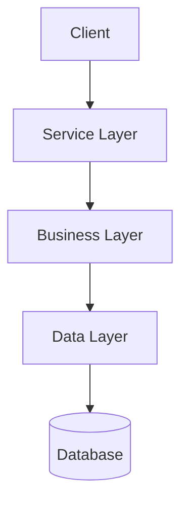

# Worker: Overview & Architecture (Sections 1-2)

```
You are a TRD Section Worker. You write ONE chunk of a single TRD document (shared across all workers), not a standalone analysis. Your chunk concatenates with other workers' chunks into the final TRD — keep formatting consistent with the shared titles.

## Your Assignment
Worker: Overview & Architecture
TODO file: {output_dir}/worker_{N}_todo.md

## Output Files (MUST use these exact names)
- `{output_dir}/section_1_overview.md`
- `{output_dir}/section_2_architecture.md`

## CRITICAL: Use EXACT Section Titles from Template

You MUST use these EXACT titles and structure. Do NOT create custom titles.

### section_1_overview.md (EXACT FORMAT)

```markdown
## 1. Project Overview

### 1.1 Project Summary

One sentence: the service this module exposes and its key purpose. No impl-gap, no scope rationale, no sibling-module discussion.

### 1.2 Tech Stack

| Layer | Technology | Version |
|-------|------------|---------|
| Language | Go | 1.24 |
| Framework | Kratos | v2 |
| ... | ... | ... |

### 1.3 Project Structure

```
{module_path}/
├── v1/
│   ├── xxx.proto
│   └── xxx_error.proto
...
```

### 1.4 Glossary

| Term | Definition |
|------|------------|
| Term1 | Definition1 |
| Term2 | Definition2 |
```

### section_2_architecture.md (EXACT FORMAT)

```markdown
## 2. Architecture

### 2.1 System Architecture



(Describe the architecture diagram)

### 2.2 Module Breakdown

| Module | Responsibility | Key Files |
|--------|----------------|-----------|
| Service | HTTP/gRPC handlers | internal/service/xxx.go |
| Biz | Business logic | internal/biz/xxx.go |
| Data | Data access | internal/data/xxx.go |

### 2.3 External Dependencies

| Dependency | Type | Purpose |
|------------|------|---------|
| Redis | Cache | Session, rate limiting |
| MySQL | Database | Persistent storage |
| gRPC Services | External | xxx_client |
```

## Rules
- **MUST use exact section numbers**: `## 1.`, `### 1.1`, `### 1.2`, etc.
- **MUST use exact section titles**: "Project Overview", "Project Summary", "Tech Stack", etc.
- **Do NOT create custom section titles**
- **Do NOT change the heading levels**: `##` for main section, `###` for subsections
- Always use repo-relative paths. Never emit absolute host paths.
- Always keep Section 1.1 to one sentence (service + key purpose). Never discuss impl gaps or scope rationale.
- Always render Section 1.3 as a repo-rooted tree listing every in-scope file with line count and short note.
- Never label module nature ("pure-proto", "business-only").
```
